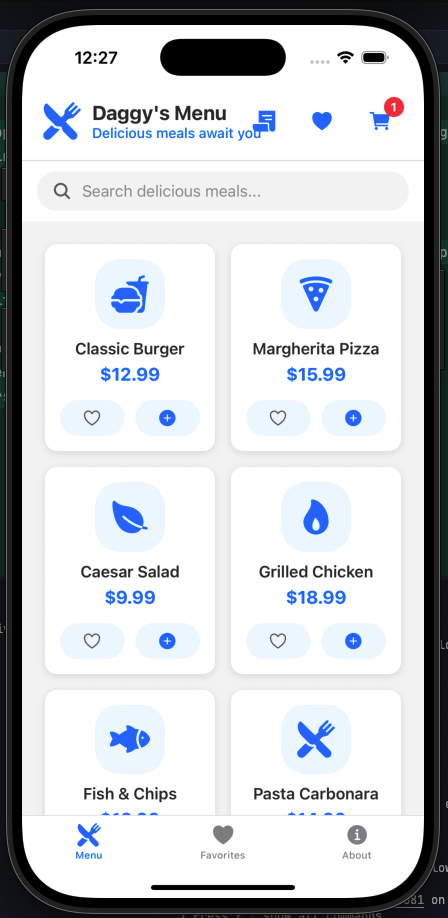
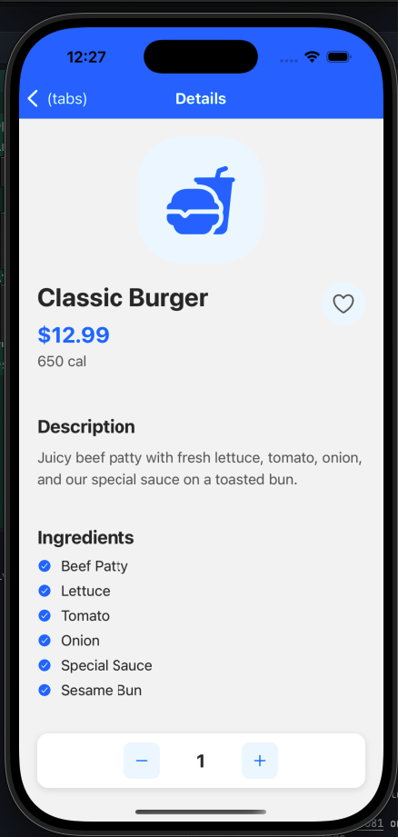
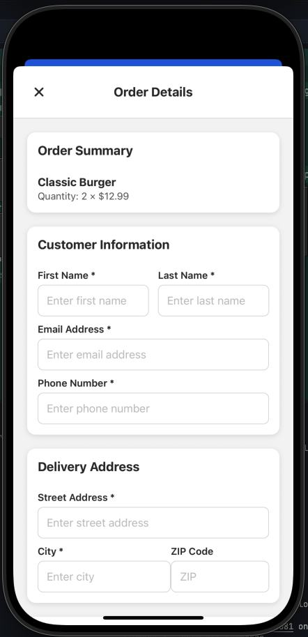
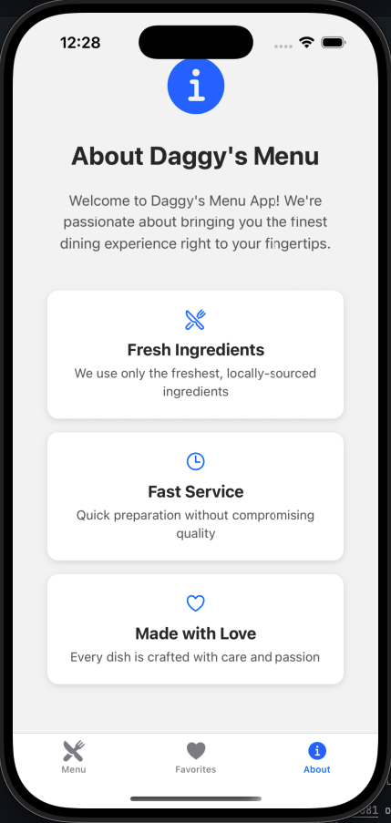

# Daggy's Menu - React Native App

A modern, mobile-first restaurant menu application built with React Native and Expo, featuring an intuitive interface for browsing menu items, managing favorites, and placing orders.

## 🚀 Features

- **Interactive Menu**: Browse through categorized food items with detailed descriptions and pricing
- **Favorites System**: Save and manage your favorite menu items
- **Shopping Cart**: Add items to cart with quantity management
- **Order Placement**: Submit orders via email with customer details
- **Responsive Design**: Optimized for both iOS and Android devices
- **Search Functionality**: Find menu items quickly
- **Order History**: Track previous orders

## 📱 Screenshots

<div align="center">
  
  
  
  
</div>

*Screenshots showcasing the Daggy's Menu app interface and features*

## 🛠️ Tech Stack

- **Framework**: React Native with Expo
- **Navigation**: Expo Router
- **Styling**: React Native StyleSheet
- **State Management**: React Context API
- **Icons**: Expo Vector Icons
- **Email Integration**: React Native Linking API

## 📋 Prerequisites

- Node.js (v16 or higher)
- npm or yarn
- Expo CLI
- iOS Simulator (for iOS development)
- Android Studio (for Android development)

## 🚀 Getting Started

### Installation

1. Clone the repository:
```bash
git clone <repository-url>
cd daggys-react-native
```

2. Install dependencies:
```bash
npm install
```

3. Start the development server:
```bash
npx expo start
```

4. Run on your preferred platform:
   - Press `i` for iOS simulator
   - Press `a` for Android emulator
   - Scan QR code with Expo Go app on your device

## 📁 Project Structure

```
app/
├── (tabs)/                 # Tab-based navigation screens
│   ├── index.jsx          # Main menu screen
│   ├── favorites.jsx      # Favorites screen
│   └── about.jsx          # About screen
├── components/            # Reusable components
│   ├── CartManager.jsx    # Shopping cart functionality
│   ├── FavoritesManager.jsx # Favorites management
│   ├── OrderForm.jsx      # Order submission form
│   ├── OrderHistory.jsx   # Order history display
│   └── SearchBar.jsx      # Search functionality
├── food-detail.jsx        # Individual food item details
└── _layout.jsx           # Root layout configuration

assets/                   # Static assets (images, icons)
context/                  # React Context providers
lib/                      # Utility functions and data
```

## 🔧 Configuration

### App Configuration

The app is configured in `app.json`:
- App name: "Daggy's Menu"
- Bundle identifier: `com.daggys.menu`
- Supports both iOS and Android
- Configured for App Store deployment

### Environment Setup

No additional environment variables required for basic functionality.

## 📱 Deployment

### Development

```bash
# Start development server
npx expo start

# Start with tunnel (for external access)
npx expo start --tunnel
```

### Production Builds

#### iOS App Store

1. Ensure you have an Apple Developer Account ($99/year)
2. Configure EAS Build:
```bash
npx eas build:configure
```
3. Build for iOS:
```bash
npx eas build --platform ios --profile production
```
4. Submit to App Store:
```bash
npx eas submit --platform ios
```

#### Android Play Store

```bash
# Build for Android
npx eas build --platform android --profile production

# Submit to Play Store
npx eas submit --platform android
```

#### Web Deployment

```bash
# Export for web
npx expo export:web

# Deploy to hosting service (Vercel, Netlify, etc.)
```

### Alternative Sharing Methods

#### Expo Go (Free)
```bash
npx expo start --tunnel
```
Users download "Expo Go" app and scan QR code.

#### TestFlight (iOS Beta)
Requires Apple Developer Account but no App Store review.

## 🎨 Customization

### Menu Data
Update menu items in the data files located in the `lib/` directory.

### Styling
Customize colors, fonts, and layouts in the component StyleSheet objects.

### Contact Information
Update restaurant contact details in `OrderForm.jsx`:
- Email: `daggyshalaal@gmail.com`
- Phone: `+27 82 490 7776`

## 🐛 Troubleshooting

### Common Issues

1. **Metro bundler issues**: Clear cache with `npx expo start --clear`
2. **iOS simulator not opening**: Ensure Xcode is installed and updated
3. **Android emulator issues**: Check Android Studio AVD configuration
4. **Build failures**: Ensure all dependencies are installed and up to date

### Order Submission Issues

- Ensure device has email client configured
- Check internet connectivity
- Verify contact information is correct

## 📄 License

This project is licensed under the MIT License - see the LICENSE file for details.

## 🤝 Contributing

1. Fork the repository
2. Create a feature branch
3. Make your changes
4. Test thoroughly
5. Submit a pull request

## 📞 Support

For support or questions:
- Email: daggyshalaal@gmail.com
- Phone: +27 82 490 7776

## 🙏 Acknowledgments

- Built with Expo and React Native
- Icons provided by Expo Vector Icons
- Inspired by modern mobile app design principles

---

**Daggy's Menu** - Bringing delicious food to your fingertips! 🍽️# daggys-react-native
